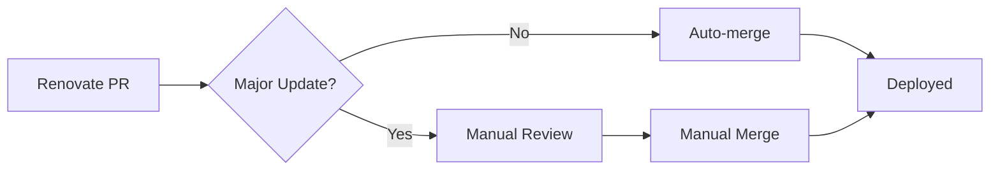

# 🛠️ .github Directory

This directory contains the CI/CD infrastructure and automation tools for the tipi-store monorepo.

## 📁 Directory Structure

```
.github/
├── workflows/              # GitHub Actions workflows
│   └── update-configs-renovate.yml
├── scripts/               # PowerShell automation scripts
│   ├── backup-config.ps1
│   ├── update-config.ps1
│   └── validate-config.ps1
└── RENOVATE_CONFIG_SUMMARY.md  # Detailed configuration documentation
```

## 🔄 Automated Workflows

### `workflows/update-configs-renovate.yml`
**Purpose**: Automated handling of Renovate dependency updates

**Features**:
- Detects changes in `apps/*/docker-compose.json`
- Automatically updates corresponding `config.json` files
- Validates configuration consistency
- Detects major version updates for manual review
- Auto-merges minor/patch updates after CI validation

**Triggers**:
- Pull requests from `renovate[bot]`
- Manual workflow dispatch

## 🔧 PowerShell Scripts

### `scripts/backup-config.ps1`
Backs up existing `tipi_version` values before updates to ensure rollback capability.

### `scripts/update-config.ps1`
Synchronizes `config.json` files with new Docker image versions from `docker-compose.json` changes.

### `scripts/validate-config.ps1`
Validates consistency between `docker-compose.json` and `config.json` files to catch configuration drift.

## 📚 Documentation

### `RENOVATE_CONFIG_SUMMARY.md`
Comprehensive documentation covering:
- Complete Renovate configuration setup
- CI/CD workflow details
- Major update detection patterns
- Security controls and automation policies
- Performance optimizations

**[📖 View Full Configuration Documentation](./RENOVATE_CONFIG_SUMMARY.md)**

## 🚦 Automation Flow



## 🏷️ Label System

- **`approved-to-merge`**: Auto-added for minor/patch updates
- **`major-update`**: Added for major version updates
- **`needs-review`**: Requires manual review before merge

## 🔐 Security Features

- **Major version protection**: Prevents automatic merging of potentially breaking changes
- **CI validation required**: All checks must pass before merge
- **Detailed logging**: Complete audit trail of all automation actions
- **Rollback capability**: Easy reversion through version backups

---

## 🚀 Getting Started

1. **Review Configuration**: Check `RENOVATE_CONFIG_SUMMARY.md` for complete setup details
2. **Monitor Workflows**: Watch GitHub Actions for automated updates
3. **Handle Major Updates**: Manually review PRs with `major-update` label
4. **Customize Scripts**: Modify PowerShell scripts as needed for your workflow

For detailed configuration and troubleshooting, see the [complete documentation](./RENOVATE_CONFIG_SUMMARY.md).
